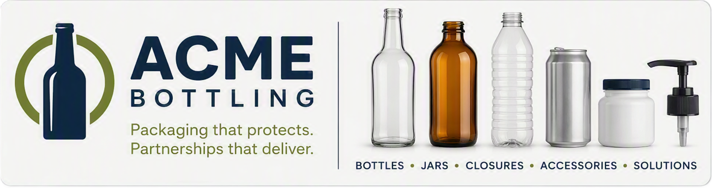

# Acme Bottling — Microsoft 365 Copilot Curriculum

Welcome. This is the home page for a set of role-based, hands-on Microsoft 365 Copilot
labs built around one fictional company: **Acme Bottling Co.**

Each session is a **standalone lab** you can follow start to finish. But they all share
the **same company and the same master dataset**, so the whole curriculum feels like one
real place. Learn the Copilot skill in your lane, and you'll also see how your work
connects to everyone else's.

> **How to use these labs:** Just read this page and follow the steps in your session.
> You don't need to install anything, sign into GitHub, download a repo, or save any
> code. Everything you need is linked right in the lab. Open, read, do. That's it.

---

## The company: Acme Bottling Co.

Acme Bottling makes glass and PET bottles, caps and closures, and custom packaging for
beverage brands across the U.S. — breweries, juice and water companies, distillers, soda
and cold-brew makers. Think amber glass bottles, 1-liter PET, screw caps, crown caps,
shipper cartons, and labels.

Because it's fictional, you can practice freely. Nothing here is real customer or
company data — it's all made up for training.

## The shared-dataset trick

Every lab pulls from one **master shipment/order dataset** plus a few linked reference
files (customers, products, suppliers, inventory). The same delayed order a Supply Chain
learner investigates is the same customer Finance reviews for payment risk and the same
product Marketing plans a launch around.

That means:

- **One story, seven angles.** You see Acme Bottling from your role's point of view.
- **Consistent names and numbers.** Priya Shah, Cascade Craft Beverages, SKU-GB12 — they
  show up across labs, so the world holds together.
- **Realistic starting point.** Most labs begin with a spreadsheet "exported from Acme's
  ERP/CRM," just like your real Monday morning.

**Master files everyone shares** (in `company-kit/data/`):

| File | What it is |
|------|------------|
| `AcmeBottling_Orders_Shipments.xlsx` | The backbone — orders, promised vs. actual dates, status, delay owner, exceptions |
| `AcmeBottling_Master_Reference.xlsx` | Customers, Products, Suppliers, Inventory, and Orders in one workbook |
| `AcmeBottling_Customers.csv` | Customer accounts, segments, regions, account managers |
| `AcmeBottling_Products.csv` | Product catalog (SKUs, sizes, materials, unit costs) |
| `AcmeBottling_Suppliers.csv` | Suppliers, what they supply, on-time status, quality scores |
| `AcmeBottling_Inventory.csv` | On-hand, committed, available, reorder flags |

> **Open the `.xlsx` files in Excel as-is — don't convert them to CSV.** Copilot in Excel
> needs the real workbook to analyze the data. The CSVs are just the raw source.

---

## The one rule to protect

**Copilot assists. A human validates.**

Every exercise ends the same way: name the source Copilot used, the assumptions it made,
the risk, and what a person must check before anyone acts on the output. Copilot speeds
up the work — it doesn't get the final say. This rule is in every lab, and it's the one
thing no session drops.

---

## The seven sessions

Delivered in this order. Each lab runs about **60 minutes of hands-on** (up to ~75 min if
your group wants to go deeper) inside a ~90-minute session — roughly 15 min Copilot
refresher, the lab, then open Q&A.

| # | Session | What you'll practice |
|---|---------|----------------------|
| 1 | **[Supply Chain / Logistics](sessions/Session_1_Supply_Chain_Logistics.md)** | Read an order/shipment export, spot delays and exceptions, decide who owns the next step, and build status briefings + escalation prompts. |
| 2 | **[Marketing & Creative](sessions/Session_2_Marketing_and_Creative.md)** | Build a campaign brief with Researcher, draft an executive presentation, and practice brand-safe prompting for a bottle launch. |
| 3 | **Finance** | Review a reporting pack for drivers and anomalies, QA a spreadsheet, and turn findings into an executive finance memo — all with human sign-off. |
| 4 | **Customer Service (ACs)** | Summarize long customer threads, build PTO handoffs, compare reports into an exception list, and draft customer-ready responses. |
| 5 | **Design & Engineering** | Analyze an opportunity/CRM export for aging and trends, flag data-quality gaps, and write a leadership summary with stated assumptions. |
| 6 | **Talent / HR** | Create interview guides, onboarding plans, and learning paths, and draft employee communications — with HR-safe guardrails. |
| 7 | **Legal** | Summarize multi-document contracts, compare clauses against Acme's standard language, and produce an executive legal briefing. |

> **Note on IT:** The IT group is a **recap and debrief conversation**, not a hands-on
> lab. We walk their team through what everyone else learned and flag agent-readiness
> opportunities. No lab file needed.

---

## The learning arc across Acme Bottling

Read top to bottom, the curriculum tells one story:

1. **Supply Chain** finds the delayed bottle orders and the exceptions behind them.
2. **Marketing** plans the launch those bottles are headed toward.
3. **Finance** checks the numbers underneath it all — variances, risk, reporting.
4. **Customer Service** handles the customers affected by delays and questions.
5. **Design & Engineering** looks across the CRM for trends and aging opportunities.
6. **Talent / HR** staffs and onboards the people who run all of it.
7. **Legal** protects the agreements holding the customer relationships together.

Same company. Same data. Seven jobs. One trusted way to use Copilot.

---

## What "intermediate" means here

You've already had foundational Copilot training and use it regularly. These labs skip
the basics and get straight into real role scenarios. Each session teaches **only the
Copilot capabilities that genuinely serve that job** — no feature tours, no filler. See
the full role → feature-map in [`company-kit/Acme_Bottling_Company_Kit.md`](company-kit/Acme_Bottling_Company_Kit.md).
